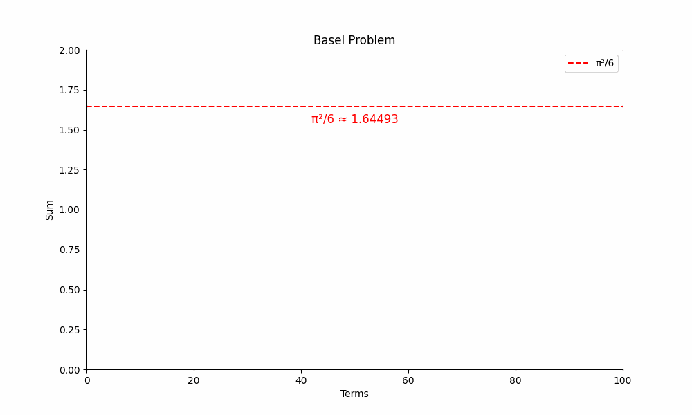

# The Basel Problem: When $\pi$ Appeared Where No One Expected

In the quiet corners of 17th-century mathematics, a deceptively simple question emerged:  
What is the sum of the reciprocals of all perfect squares?

$$
1 + \frac{1}{4} + \frac{1}{9} + \frac{1}{16} + \cdots = ?
$$

Known as the Basel Problem, it perplexed Europe’s brightest minds for nearly a century, its answer hovering just out of reach—until Leonhard Euler, in 1735, dropped a bombshell that turned bewilderment into awe: the sum was 
$\frac{\pi^2}{6}$.  

  

To plot the curve in Python, use the following code, [View `pi-sq-over-6.py`](Python/pi-sq-over-6.py).  

  

To plot the animation, use the following code, [View `pi-sq-over-6-animation.py`](Python/pi-sq-over-6-animation.py).    

The sudden appearance of π, the circle’s constant, in this arithmetic puzzle about squares left mathematicians reeling, revealing a hidden connection that no one saw coming and forever altering their view of the mathematical landscape.  
The Basel Problem, first posed by Pietro Mengoli in 1644, was a tantalizing enigma. Unlike the harmonic series:  

$$
1 + \frac{1}{2} + \frac{1}{3} + \frac{1}{4} + \cdots,
$$

which sprawls toward infinity, this series (with terms shrinking as $\frac{1}{n^2}$) promised a finite limit. Mathematicians like Jakob Bernoulli and Leibniz chipped away at it, adding terms by hand: $1 + 0.25 + 0.111 + 0.0625 \approx 1.4236$, then more, inching toward 1.6449…. But the exact value? A mystery. They expected a number—perhaps a fraction or a curious constant—but π? That was unthinkable. To them, π belonged to geometry, measuring circles and spheres, not to the orderly progression of squared integers. The problem’s stubborn silence only deepened its mystique, setting the stage for an unexpected twist.  
Then came Euler, a 28-year-old Swiss genius, who in 1735 unveiled the answer: $\frac{\pi^2}{6} \approx 1.64493$.
The precision matched earlier approximations, but the presence of π hit like a thunderbolt. How could a sum of fractions like $\frac{1}{4}$ and  $\frac{1}{9}$, rooted in the grid-like world of numbers, summon π, the emblem of curves and cycles? Euler’s method was as startling as the result. Euler’s method was as startling as the result. He turned to the sine function’s Taylor series:

$$
\sin(x) = x - \frac{x^3}{6} + \frac{x^5}{120} - \cdots
$$

and expressed it as an infinite product based on its zeros:

$$
\sin(x) = x \prod_{n=1}^{\infty} \left(1 - \frac{x^2}{n^2 \pi^2}\right)
$$

By matching coefficients, he teased out that

$$
\sum_{n=1}^{\infty} \frac{1}{n^2} = \frac{\pi^2}{6}
$$

This leap—from arithmetic to trigonometry—dumbfounded his peers. The Bernoulli family, who’d wrestled with the problem in Basel, and others like Daniel Bernoulli, were left marveling at the audacity of a solution that dragged π into a place it wasn’t supposed to be.

The shock wasn’t just in the answer but in what it implied. Mathematicians had seen π as a geometric outsider, irrelevant to sums of squares. Yet here it was, crashing the party, suggesting a secret handshake between algebra and geometry. This wasn’t a fluke — $\frac{\pi^2}{6}$ (later tied to the Riemann zeta function as ζ(2)) hinted at a profound unity in mathematics. The community was stunned because no one had expected such a crossover. Jakob Bernoulli had called the problem “most difficult,” and Leibniz had fumbled for a pattern, but Euler’s π revealed a connection they’d never dreamed of. It was as if a painter found a symphony in their brushstrokes—beautiful, bewildering, and utterly unanticipated.  
​
The Basel Problem’s resolution rippled far beyond its time. That π appeared where no one expected sparked new questions: What other sums hide π? How deep do these connections run? It popped up in physics, probability, and even the study of primes, cementing its legacy as a gateway to modern analysis. Euler’s triumph turned a nagging curiosity into a cornerstone, but the initial stun—the gasp of seeing 
π in a sum of squares—remains its heart. It’s a reminder that mathematics thrives on surprise, and sometimes, the most familiar guests, like π, show up in the strangest places, leaving us to wonder at the elegance of it all.


---

## **1. The Basel Problem Statement**
The problem asks for the exact value of:

$$
\sum_{n=1}^\infty \frac{1}{n^2} = 1 + \frac{1}{4} + \frac{1}{9} + \frac{1}{16} + \cdots
$$

The answer, proven by Euler in 1734, is:

$$
\sum_{n=1}^\infty \frac{1}{n^2} = \frac{\pi^2}{6}.
$$

---

## **2. Why Does $\pi$ Appear?**
The key lies in the deep connections between infinite series, trigonometric functions, and polynomials. Here are the main intuitions:

### **(A) Sine Function and Its Roots**
- The sine function $\sin(x)$ can be written as an infinite polynomial (Taylor series):
 
$$
\sin(x) = x - \frac{x^3}{3!} + \frac{x^5}{5!} - \cdots
$$
  
- But $\sin(x)$ can also be factored (like a finite polynomial) in terms of its roots (where $\sin(x) = 0$):

$$
\sin(x) = x \left(1 - \frac{x}{\pi}\right)\left(1 + \frac{x}{\pi}\right)\left(1 - \frac{x}{2\pi}\right)\left(1 + \frac{x}{2\pi}\right) \cdots
$$
  
- Or more compactly:
  
$$
\sin(x) = x \prod_{n=1}^\infty \left(1 - \frac{x^2}{n^2 \pi^2}\right).
$$

### **(B) Comparing the Two Representations**
If we expand the infinite product, the coefficient of $x^3$ must match in both representations:
1. From the Taylor series:

$$
\sin(x) = x - \frac{x^3}{3!} + \frac{x^5}{5!} - \frac{x^7}{7!} + \cdots  = x - \frac{x^3}{6} + \frac{x^5}{120} - \frac{x^7}{5040} + \cdots
$$
   
(Coefficient of $x^3$ is $-\frac{1}{6}$.)

2. From the product expansion, the $x^3$ term comes from multiplying the $x$ term with the $-\frac{x^2}{n^2 \pi^2}$ terms:

$$
\sin(x) = x \left(1 - \frac{x^2}{\pi^2} \left(1 + \frac{1}{4} + \frac{1}{9} + \cdots \right) + \cdots \right).
$$
   
(Coefficient of $x^3$ is $-\frac{1}{\pi^2} \sum_{n=1}^\infty \frac{1}{n^2}$.)

### **(C) Equating the Coefficients**
Set the $x^3$ terms equal:

$$
-\frac{1}{6} = -\frac{1}{\pi^2} \sum_{n=1}^\infty \frac{1}{n^2}.
$$

Solving for the sum:

$$
\sum_{n=1}^\infty \frac{1}{n^2} = \frac{\pi^2}{6}.
$$

---

## **3A. Fourier Series Interpretation (Energy of a Wave, Optional)**

A deeper reason for π's appearance comes from Fourier analysis, where the Basel sum emerges naturally when calculating the energy (or average squared amplitude) of a periodic function.

### Key Idea: Parseval's Theorem

For a function $f(x)$ expressible as a Fourier series, Parseval’s theorem relates the sum of squared Fourier coefficients to the function’s average energy:

$$
\frac{1}{2\pi} \int_{-\pi}^{\pi} |f(x)|^2 \, dx = \frac{a_0^2}{4} + \frac{1}{2} \sum_{n=1}^{\infty} (a_n^2 + b_n^2),
$$

where $a_n$ and $b_n$ are Fourier coefficients.

---

#### Example: The Sawtooth Wave

  

To plot the curve in Python, use the following code, [View `sawtooth.py`](Python/sawtooth.py).  

Consider the odd function $f(x) = x \quad \text{for} \quad x \in (-\pi, \pi)$, extended periodically with period 2π (creating a repeating sawtooth pattern). 
Since $f(x)$ is odd, its Fourier series contains only sine terms (all cosine coefficients $a_n = 0$):

$$
f(x) = \sum_{n=1}^{\infty} b_n \sin(nx)
$$

where $b_n$ is:

$$
b_n = \frac{1}{\pi} \int_{-\pi}^{\pi} x \sin(nx)dx
$$

Use integration by parts: 
```math
∫ u dv = uv - ∫ v du
```

Let 
```math
u = x ⇒ du = dx
```

Let 
```math
dv = sin(nx)dx ⇒ v = -cos(nx)/n
```

Apply integration by parts:

$$
\int x \sin(nx)dx = -\frac{x \cos(nx)}{n} + \frac{1}{n} \int \cos(nx)dx
$$

$$
= -\frac{x \cos(nx)}{n} + \frac{\sin(nx)}{n^2} + C
$$

Evaluate from -π to π:

$$
b_n = \frac{1}{\pi} \left[ \left( -\frac{\pi \cos(n\pi)}{n} + \frac{\sin(n\pi)}{n^2} \right) - \left( -\frac{(-\pi) \cos(-n\pi)}{n} + \frac{\sin(-n\pi)}{n^2} \right) \right]
$$

Simplify using:

$$
sin(nπ) = sin(-nπ) = 0 \text{ for all integers } n,
$$

$$
cos(nπ) = cos(-nπ) = (-1)^n
$$ 

$$
b_n = \frac{1}{\pi} \left[ -\frac{\pi (-1)^n}{n} - \frac{\pi (-1)^n}{n} \right] = \frac{2(-1)^{n+1}}{n}
$$

Now, let's construct the Fourier series by substituting the coefficients:

$$
x = 2 \sum_{n=1}^{\infty} \frac{(-1)^{n+1}}{n} \sin(nx).
$$

By Parseval’s theorem:

$$
\frac{1}{2\pi} \int_{-\pi}^{\pi} x^2dx = \frac{1}{2} \sum_{n=1}^{\infty} \left( \frac{2(-1)^{n+1}}{n} \right)^2.
$$

Simplifying:

$$
\frac{\pi^2}{3} = 2 \sum_{n=1}^{\infty} \frac{1}{n^2},
$$

which yields the Basel sum:

$$
\sum_{n=1}^{\infty} \frac{1}{n^2} = \frac{\pi^2}{6}.
$$

---

#### Why $\pi$ Appears Here

- The integral $\int x^2 \, dx$ computes the energy of \$f(x) = x$.
- The Fourier coefficients $\frac{1}{n}$ encode the contribution of each sine wave $\sin(nx)$.
- Squaring these ($\frac{1}{n^2}$) and summing them balances the original energy ($\pi^2/3$), forcing $\pi$ into the series.

#### Geometric Connection to Circles

Fourier series decompose functions into sine/cosine waves—functions tied to circles. Thus, summing their contributions inherently involves $\pi$ through the geometry of rotational motion.

---

## **3B. Fourier Series Interpretation ($f(x) = x^2$ on $[-\pi, \pi]$, Optional)**

The Fourier series for  $f(x) = x^2$ on the interval $[- \pi, \pi]$ ties directly to the Basel Problem:  

$$
\sum_{n=1}^{\infty} \frac{1}{n^2} = \frac{\pi^2}{6}
$$  

This is a fantastic choice because the Fourier coefficients directly involve $\frac{1}{n^2}$, making the link to Basel explicit and visually compelling.  


  

To plot the curve in Python, use the following code, [View `x_squared_Fourier.py`](Python/x_squared_Fourier.py).  


### 1. **Function and Periodicity**
- $f(x) = x^2$ is an even function (symmetric about $x = 0$), defined here on $[-\pi, \pi]$.  
- In Fourier analysis, we often extend it periodically with period $2\pi$, but since $f(x) = x^2$ is continuous and even, we focus on its behavior within $[-\pi, \pi]$ for simplicity. The periodic extension would repeat the parabola, but we’re approximating it directly on this interval.  

### 2. **Fourier Series**
- For an even function on $[-\pi, \pi]$, the Fourier series has only cosine terms (sine terms vanish due to odd symmetry of $\sin(x)$ ):  

$$
  f(x) = \frac{a_0}{2} + \sum_{n=1}^\infty a_n \cos(nx)
$$
  
- Coefficients:
  - $a_0 = \frac{1}{\pi} \int_{-\pi}^\pi f(x)dx = \frac{1}{\pi} \int_{-\pi}^\pi x^2dx$  
    - $\int_{-\pi}^\pi x^2 \, dx = 2 \int_0^\pi x^2dx = 2 \left[ \frac{x^3}{3} \right]_0^\pi = 2 \cdot \frac{\pi^3}{3} = \frac{2\pi^3}{3}$  
    - $a_0 = \frac{1}{\pi} \cdot \frac{2\pi^3}{3} = \frac{2\pi^2}{3}$  
    - So, $\frac{a_0}{2} = \frac{\pi^2}{3}$.  
      
  - $a_n = \frac{1}{\pi} \int_{-\pi}^\pi x^2 \cos(nx)dx = \frac{2}{\pi} \int_0^\pi x^2 \cos(nx)dx$ (even function)  
    - Integration by parts:  
      - $u = x^2$, $du = 2xdx$  
      - $dv = \cos(nx)dx$, $v = \frac{\sin(nx)}{n}$  
      - $\int x^2 \cos(nx)dx = \frac{x^2 \sin(nx)}{n} - \int \frac{\sin(nx)}{n} \cdot 2xdx$  
      - Second part: $\int 2x \frac{\sin(nx)}{n}dx$, let $u = 2x$, $dv = \frac{\sin(nx)}{n}dx$, $v = -\frac{\cos(nx)}{n^2}$  
      - $= -\frac{2x \cos(nx)}{n^2} + \int \frac{2 \cos(nx)}{n^2}dx = -\frac{2x \cos(nx)}{n^2} + \frac{2 \sin(nx)}{n^3} + C$  
      - Evaluate from 0 to $pi$: $\left[ \frac{x^2 \sin(nx)}{n} - \frac{2x \cos(nx)}{n^2} + \frac{2 \sin(nx)}{n^3} \right]_0^\pi$
        - $\sin(n\pi) = 0$, $\cos(n\pi) = (-1)^n$, $\cos(0) = 1$  
        - $= \left( 0 - \frac{2\pi (-1)^n}{n^2} + 0 \right) - \left( 0 - \frac{0 \cdot 1}{n^2} + 0 \right) = -\frac{2\pi (-1)^n}{n^2}$  
      - $a_n = \frac{2}{\pi} \cdot -\frac{2\pi (-1)^n}{n^2} = \frac{4 (-1)^n}{n^2}$  
- Series: $f(x) = \frac{\pi^2}{3} + \sum_{n=1}^\infty \frac{4 (-1)^n}{n^2} \cos(nx)$


### 3. **Link to Basel Problem**
- Evaluate at $x = \pi:  f(\pi) = \pi^2$  
  
$$  
\pi^2 = \frac{\pi^2}{3} + \sum_{n=1}^\infty \frac{4 (-1)^n}{n^2} \cos(n\pi)  
$$  
  - $\cos(n\pi) = (-1)^n$  
  - $\pi^2 = \frac{\pi^2}{3} + \sum_{n=1}^\infty \frac{4 (-1)^n (-1)^n}{n^2} = \frac{\pi^2}{3} + \sum_{n=1}^\infty \frac{4}{n^2}$  
  - $\pi^2 - \frac{\pi^2}{3} = \frac{4}{n^2}$  
  - $\frac{2\pi^2}{3} = 4 \sum_{n=1}^\infty \frac{1}{n^2}$  
  - $\sum_{n=1}^\infty \frac{1}{n^2} = \frac{\pi^2}{6}$  
- **Connection**: The $\frac{1}{n^2}$ terms in the coefficients, when summed, yield the Basel sum directly.

### 4. **Why $\pi$?**
- $\pi$ appears because the interval $[-\pi, \pi]$ (period $2\pi$) defines the frequency of $\cos(nx)$, and the $x^2$ energy integrates to $\pi$-dependent terms. The $\frac{1}{n^2}$ arises from double integration, linking to Basel.

### 5. How The Code Reflects This
- **Constant Term**: `np.full_like(x, np.pi**2 / 3)` is $\frac{a_0}{2}$.
- **Cosine Terms**: `an = 4 * (-1)**n / n**2` matches $a_n$, adding $\cos(nx)$ contributions.
- **Animation**: Builds from 1 to 20 terms, approximating $x^2$, with the label hinting at the Basel sum.
- **Limits**: $y \in [-1, 12]$ covers $x^2$’s range (0 to $\pi^2 \approx 9.87$) plus wiggle room for overshoots.

### 6. Visualization Insight
- The blue dashed line starts at $\frac{\pi^2}{3} \approx 3.29$ (flat), then adds cosine waves, bending to match the parabola. At $x = \pi$, the full sum equals $\pi^2$, and the $\frac{1}{n^2}$ terms tie to $\pi^2/6$.

### 7. Summary
- We built $x^2$ from $-\pi$ to $\pi$ with cosines. The coefficients have $1/n^2$—add them up at $x = \pi$, and you get $\pi^2/6$, the Basel Problem! $\pi$ sneaks in from the interval and the wave’s shape.

---

## **5. Euler’s Original Proof (Simplified)**
Euler’s genius was in treating $\sin(x)$ as an infinite polynomial and boldly applying finite algebraic techniques to it. Here’s a rough sketch:
1. Assume $sin(x)/x$ can be factored like a polynomial with roots at $\pm \pi, \pm 2\pi, \dots$:

$$
   \frac{\sin(x)}{x} = \left(1 - \frac{x^2}{\pi^2}\right)\left(1 - \frac{x^2}{4\pi^2}\right)\left(1 - \frac{x^2}{9\pi^2}\right) \cdots
$$
   
2. Expand the product and compare coefficients to the Taylor series of $\sin(x)/x$.

---

## **Conclusion**
The appearance of $\pi$ in the Basel problem arises from the deep link between:
- Infinite series,
- Factorization of functions (like $\sin(x)$ ),
- And the geometry of circles (via trigonometric functions).

This result is not just a curiosity—it’s a cornerstone of analysis, number theory, and even physics (e.g., quantum mechanics and signal processing). The fact that $\pi$ emerges from summing reciprocals of squares is a beautiful example of the interconnectedness of mathematics!

---

# Appendix

## Script

GitHub Link: https://github.com/Einsteinish/Basel-Problem

Think about adding up numbers like 1, a quarter, a ninth, a sixteenth, and so on forever.   
Just a series of fractions that keep getting smaller. No circles, no angles, nothing fancy.   
Any guess what this sum equals? 
It’s $\frac{\pi^2}{6}$!   
π? 
In a bunch of fractions? 
  
Today, we're exploring the Basel Problem to see why this famous mathematical constant shows up in such an unexpected place.   
It's pretty fascinating!  

In the 1700s, mathematicians were really interested in infinite sums.   
One big question was about the sum of reciprocals of squares—1 over 1 squared, 1 over 2 squared, 1 over 3 squared, and so on.   
This became known as the Basel Problem, named after the Swiss town where many mathematicians worked.   
People knew it added up to something around 1.64493, but they wanted the exact value.

Then Leonhard Euler, an incredibly talented mathematician, solved it in 1735: 
it's exactly $\frac{\pi^2}{6}$, which is about 1.64493.  
But why would π be involved?   
There's no circle anywhere in this problem!  

Here's the interesting part.   
Euler looked at the sine function—not because it relates to circles, but because it has a pattern of zeros. 
Sine equals zero at 0, π, 2π, 3π, and so on.  

He represented sine as an infinite polynomial, with each zero (like π, 2π)  
becoming a factor in the equation: (1 - x/π), (1 - x/2π), and so on.   
When you multiply these together, you get the sine function!

The clever part:   
when you expand that product and compare it with the standard sine formula,  
the sum of 1 over n squared appears, connected to π squared.   
It's as if π is hidden within these wave patterns.

For a modern perspective, imagine a function from -π to π that repeats forever.   
We can construct it using sine waves that add up perfectly—what mathematicians call a Fourier series.   
When you work through the equations, π emerges again because these waves naturally operate on a π-sized scale.
So why does π show up here?   
It's not really about circles in this case.   
π represents the fundamental rhythm of waves—whether in sine functions or Fourier series.   
The sum of 1 over n squared behaves like a frequency pattern, with π connecting everything together.  

π is truly a universal constant that appears whenever math involves patterns, waves, or symmetry.   
From adding up fractions to quantum physics, π keeps showing up in surprising places!  
The Basel Problem shows that π isn't just about circles—it's much more fundamental to mathematics than that.   
Pretty amazing when you think about it!

GitHub Link: https://github.com/Einsteinish/Basel-Problem
---
